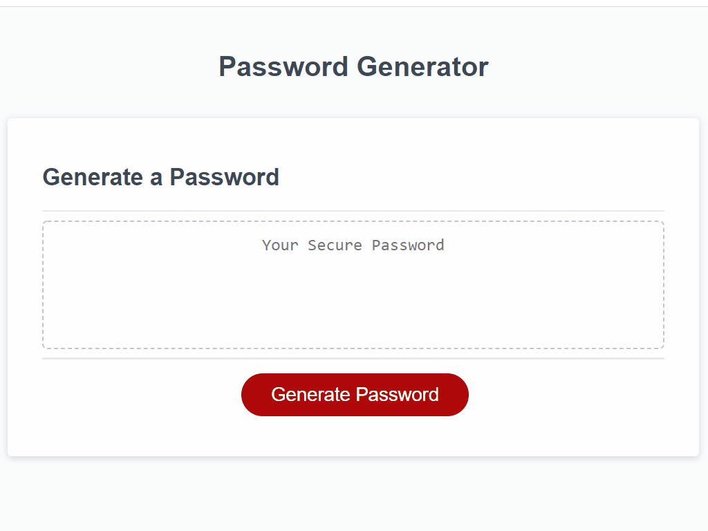

# Password Generator

## Details

This Password Generator project modifies the `script.js` file to create an application that enables employees to generate random passwords based on criteria that they’ve selected. This app runs in the browser and features dynamically updated HTML and CSS powered by JavaScript code. It features a clean and polished, responsive user interface that adapts to multiple screen sizes.

The password includes special characters as in [list of password special characters](https://www.owasp.org/index.php/Password_special_characters) from the OWASP Foundation.

## Mock-Up

The following image shows the web application's appearance and functionality:

- - -
© 2022 Umair Khalid. Confidential and Proprietary. All Rights Reserved.
